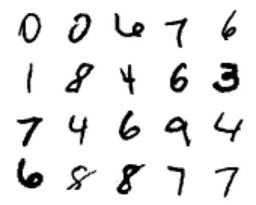

# GANs implementation using MNIST data

This repo is a collection of the implementations of many GANs. 
In order to make the codes easy to read and follow,
 I minimize the code and run on the same MNIST dataset.

What does the MNIST data look like?

Toy implementations are organized as following:

**1. No condition**

- [Deep Convolutional GAN (DCGAN)](#DCGAN) 
- [Least Squares GAN (LSGAN)](#LSGAN)
- [Wasserstein GAN (WGAN)](#WGAN) 
    - [Gradient Penalty (WGAN gp)](#WGANpg) 
    - [Wasserstein Divergence (WGAN_div)](#WGANdiv)
    
**2. With conditions**

- [Conditional GAN (CGAN)](#CGAN) 
- [Auxiliary Classifier GAN (ACGAN)](#ACGAN) 
- [InfoGAN](#InfoGAN) 

**3. Image to image transformation**

- [Context-Conditional GAN (CCGAN)](#CCGAN)
- [CycleGAN](#CycleGAN)
- [Pix2Pix](#Pix2Pix)
- [Super-Resolution GAN](#SRGAN)
- WIP
 
 
## DCGAN
[Generative Adversarial Nets](https://papers.nips.cc/paper/5423-generative-adversarial-nets.pdf)

[Unsupervised Representation Learning with Deep Convolutional Generative Adversarial Networks](https://arxiv.org/pdf/1511.06434.pdf)

[code](gan.py)

 
## LSGAN
[Least Squares Generative Adversarial Networks](https://arxiv.org/pdf/1611.04076.pdf)

[code](lsgan.py)

## WGAN
[Wasserstein GAN](https://arxiv.org/pdf/1701.07875.pdf)

[code](wgan.py)

## WGANpg
[Improved Training of Wasserstein GANs](https://arxiv.org/pdf/1704.00028.pdf)

[code](wgan_gp.py)

## WGANdiv
[Wasserstein Divergence for GANs](https://arxiv.org/pdf/1712.01026.pdf)

[code](wgan_div.py)

## CGAN
[Conditional Generative Adversarial Nets](https://arxiv.org/pdf/1411.1784.pdf)

[code](cgan.py)

## ACGAN
[Conditional Image Synthesis with Auxiliary Classifier GANs](https://arxiv.org/pdf/1610.09585.pdf)

[code](acgan.py)

## InfoGAN
[InfoGAN: Interpretable Representation Learning by Information Maximizing Generative Adversarial Nets](https://arxiv.org/pdf/1606.03657.pdf)

[code](infogan.py)

## CCGAN
[Semi-Supervised Learning with Context-Conditional Generative Adversarial Networks](https://arxiv.org/pdf/1611.06430.pdf)

[code](ccgan.py)

## CycleGAN
[Unpaired Image-to-Image Translation using Cycle-Consistent Adversarial Networks](https://arxiv.org/pdf/1703.10593)

[code](cyclegan.py)

## Pix2Pix
[Image-to-Image Translation with Conditional Adversarial Networks](https://arxiv.org/pdf/1611.07004.pdf)

[code](pix2pix.py)

## SRGAN
[Photo-Realistic Single Image Super-Resolution Using a Generative Adversarial Network](https://openaccess.thecvf.com/content_cvpr_2017/papers/Ledig_Photo-Realistic_Single_Image_CVPR_2017_paper.pdf)

[code](srgan.py)

